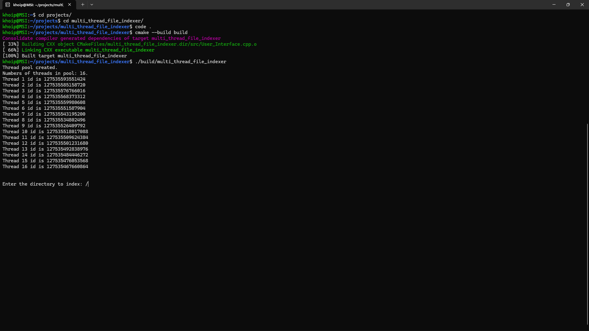
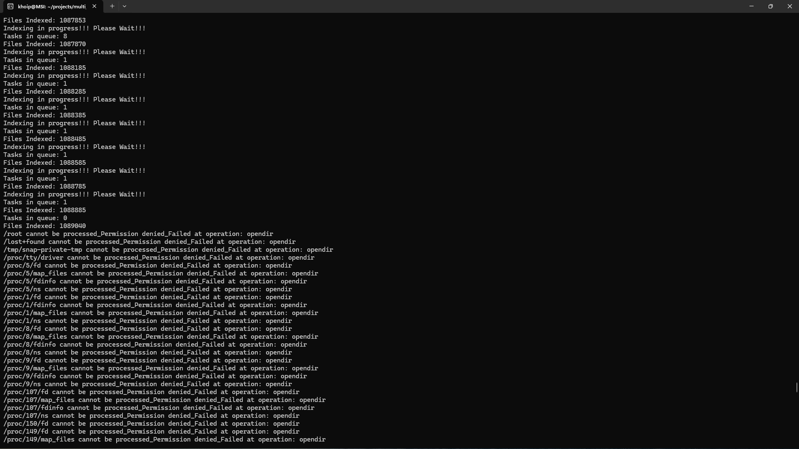
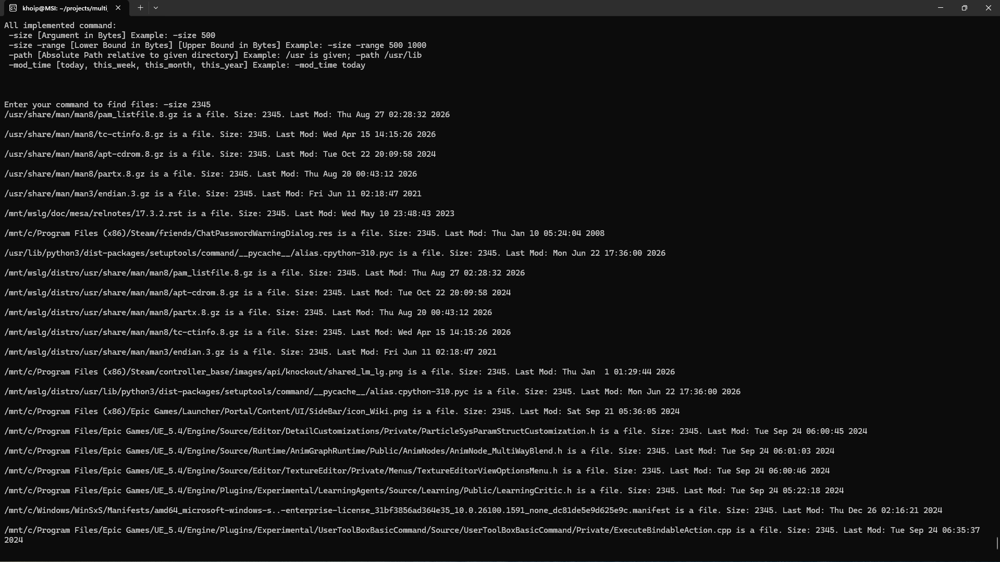
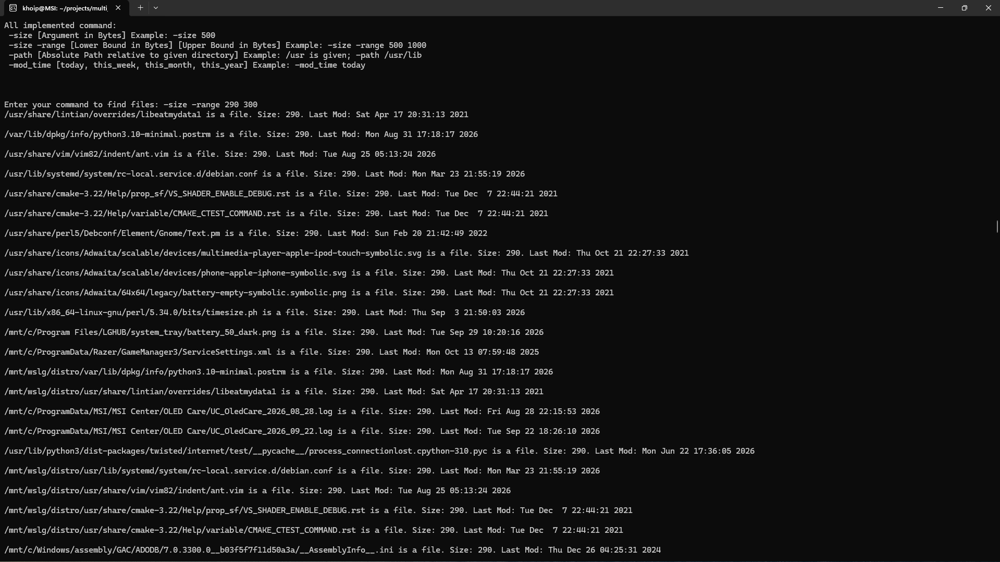

## Project Description:

This is a multithread file indexer program. Given a a path it will scan and index all files and directories including the given path. This is a demonstration of using POSIX to traverse Linux filesystem, C++20 features, templates, constrains/concepts, type erasure, thread, data structure, RAII and architecting a coherent project.

## What problem it solves:

After the program finished scanning the files and directories in a given path, it then can be quick search to get all the files or directories inside that path using path, modified timed and size of the files and directories.

## Requirements:

Linux

Cmake 3.20 or newer

A C++20 compiler (GCC 11+ or Clang 14+)


## Build instructions:

```bash
git clone https://github.com/PorosEnyoyers/multi_thread_file_indexer
cd multi_thread_file_indexer
cmake -S . -B build -DCMAKE_BUILD_TYPE=Release
cmake --build build -j
```
The binary is at `build/multi_thread_file_indexer`

## Run instructions:

```bash
./build/multi_thread_file_indexer
```

Enter an absolute path for the indexer to index all the files and directories underneath that path.

All implemented command: 

-size [Argument in Bytes] Example: -size 500

-size -range [Lower Bound in Bytes] [Upper Bound in Bytes] Example: -size -range 500 100

-path [Absolute Path relative to given directory] Example: /usr is given; -path /usr/lib

-mod_time [today, this_week, this_month, this_year] Example: -mod_time today

Starting program. Entering path pop up:


Finished indexing with info and log printed:


Search for size:


Search for range size:



